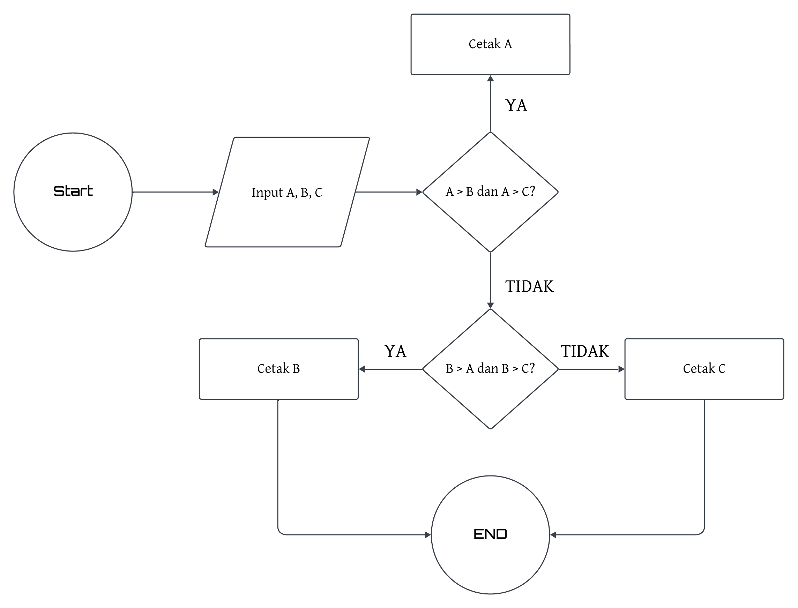
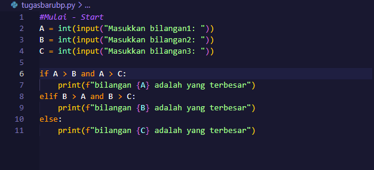

# Praktikum3

## Flowchart

saya akan membuat sebuah kode python dengan berdasarkan flowchart diatas

## Coding

Berdasarkan gambar diatas, pertama tama kita akan membuat 3 buah variable sebagai contoh disini saya membuat variable "A, B, dan C". lalu kemudian setelah membuat variable, di setiap variable di masukkan sebuah user-input lalu user-input tersebut di masukkan ke dalam int() agar setiap input yang dimasukkan akan keluar sebagai sebuah integer. Lalu setelah itu waktunya membuat sebuah if-statement 

pertama ketikan if lalu masukkan "A > B and A > C" lalu kemudian print("bilangan A lah yang terbesar"). Maksudnya adalah jika variable "A" lebih besar dari variable "B" dan variable "A" lebih besar dari variable "C" jika Iya maka print("bilangan A lah yang terbesar") jika Tidak lanjutkan ke Perintah berikutnya.

Kedua ketikan elif lalu masukkan "B > A and B > C" lalu kemudian print("bilangan B lay yang terbesar"). Maksudnya adalah jika variable "B" lebih besar dari variable "A" dan variable "B" lebih besar dari variable "C" jika Iya maka print("bilangan B lah yang terbesar") jika tidak lanjutkan ke Perintah berikutnya. jika Perintah pertama hasilnya adalah Tidak maka yang Perintah inilah yang dijalankan, namun jika Perintah pertama dan Perintah kedua hasilnya adalah Tidak maka yang akan dijalankan adalah Perintah selanjutnya yaitu:

Ketiga ketikan else lalu langsung ketikkan print("bilangan C lah yang terbesar"). maksudnya adalah ketika Perintah pertama dan kedua hasilnya tidak maka Perintah inilah yang akan di cetak.

## Hasil
Jika program diatas dijalankan user akan disuruh untuk memasukkan 3 buah angka lalu akan di cari tahu manakah bilangan yang terbesar dan akan dicetak seperti gambar disamping.

sebagai contoh saya memasukkan bilangan 1 = 90, bilangan 2 = 100, kemudian bilangan 3 = 110 dan hasilnya adalah bilangan 110 lah yang terbesar diantara bilangan 90 dan 100.

# Terima Kasih